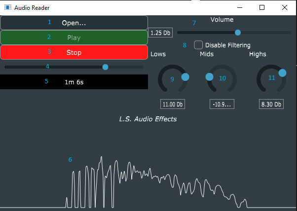

# Title: Audio Reader Project

# Project Description

Audio Reader is a Gui app built with the JUCE framework for Audio development. A WAV file can be loaded, played and we can move around the track thanks to a slider.
Moreover a few DSP blocks allow to apply a gain and change the tonal balance thanks to two shelving filter, one for low frequencies and one for high frequencies.  

## Audio Reader App GUI Description 

1. Button for choosing a WAV file to read and play
2. Once a WAV file is chosen it can be played pressing this button
3. Stop the reproduction of audio and bringing back the audio file to initial position
4. This slider moves according to playing track time. Moving the slider position it is possible to change time position of the audio track as well. Active only when audio is playing.
5. Label for displaying reproduction time of the track.
6. When the audio is playing FFT is computed in real-time and shown.
7. Slider to change vulume, applys a gain in Db.
8. Toggle button to disable or enabling the filtering. When clicked the three filters are sisabled and the original audio is played.
9. Low Shelving filter with cut frequency of 400Hz. It can boost or cut the low end of the audio signal.
10. Peaking filter with centre frequency of 700Hz. It can boost or cut the mid range frequencies of the audio.
11. High Shelving filter with cut frequency of 2000Hz. It can boost or cut the high end of audio signal. 

# How to Install and Run the Project

A ready to use executable for **windows** is present in: 

    cmake-build-dir/AudioReader_artefacts/Release/

For building the source code Cmake [2] is used. Moreover the JUCE audio framework [1] [3] is a dependency.
The project can be built in the following way:

    cd ../audio_reader
    git clone --recurse-submodules https://github.com/juce-framework/JUCE.git
    git submodule update --init --recursive
    cmake -B cmake-build-dir
    cmake --build cmake-build-dir --config release
    ./cmake-build-dir/AudioReader_artefacts/Release/audio_reader.exe

Note: In resources folder there is a test WAV file to load into the audio reader application. 

# References

[1] https://github.com/juce-framework/JUCE
[2] https://github.com/juce-framework/JUCE/README cmake section
[3] https://juce.com/learn/tutorials/